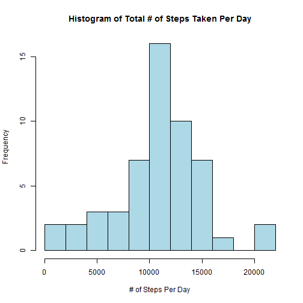
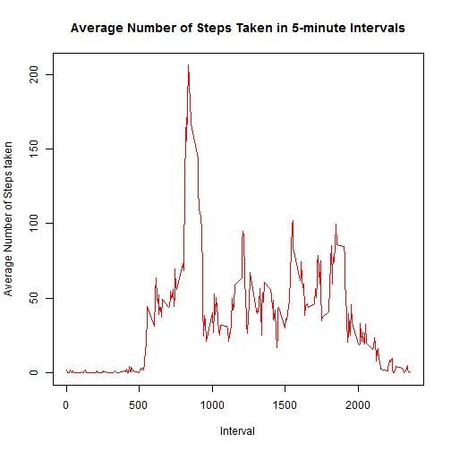
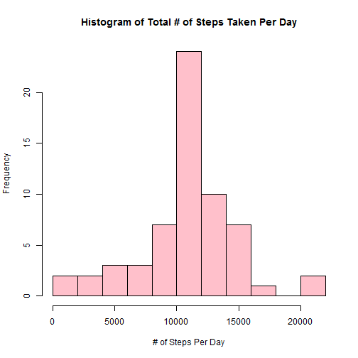
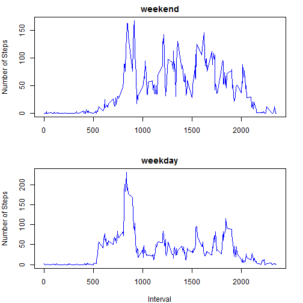

                                              Peer Assessment Project 1
======================================================================================================================

### Loading the data


```r
  activity <- read.csv('activity.csv')
```


### What is mean total number of steps taken per day?

1. Calculate the total number of steps taken per day

```r
  new.activity <- activity[complete.cases(activity),]  
  new.activity$date <- factor(new.activity$date)       
  steps.byday <- sapply(split(new.activity$steps,new.activity$date),sum)
```

2. Make a histogram of the total number of steps taken each day

```r
  hist(steps.byday,col='lightblue', breaks=10,main='Histogram of Total # of Steps Taken Per Day', xlab='# of Steps Per Day')
```

 

3. Calculate and report the mean and median of the total number of steps taken per day

```r
  StepsPerDay.mean <- round(mean(steps.byday),2)
  StepsPerDay.median<- round(median(steps.byday),2)
```
The mean of the total number of steps taken per day : 1.076619 &times; 10<sup>4</sup>

The median of the total number of steps taken per day: 1.0765 &times; 10<sup>4</sup>


### What is the average daily activity pattern?

1. Make a time series plot (i.e. type = "l") of the 5-minute interval (x-axis) and the average number of steps taken, averaged across all days (y-axis)

```r
  steps.byinterval <- aggregate(activity$steps,list(interval=activity$interval),mean, na.rm=TRUE)
  plot(steps.byinterval, xlab='Interval', ylab='Average Number of Steps taken',type='l',col='red', main='Average Number of Steps Taken in 5-minute Intervals')
```

 

2. Which 5-minute interval, on average across all the days in the dataset, contains the maximum number of steps?

```r
  (interval.mostActive<- steps.byinterval[order(steps.byinterval$x,decreasing=TRUE),][1,1])
```

```
## [1] 835
```


### Imputing missing values with the mean for that 5-minute interval

1. Calculate and report the total number of missing values in the dataset (i.e. the total number of rows with NAs)

```r
  nrows.NA <- sum(complete.cases(activity)==FALSE)    
  nInterval.NA <- sum(is.na(activity$interval))      
  nDate.NA <- sum(is.na(activity$date))              
  nSteps.NA <- sum(is.na(activity$steps))  
```
Number of rows with NA: 2304

Number of interval value with NA: 0

Number of date with NA: 0

Number of steps with NA: 2304

2. Impute missing data with the mean for that 5-minute interval

```r
  activity.merge <-merge(x=steps.byinterval,y=activity,all=TRUE)
  activity.merge$steps<- ifelse(is.na(activity.merge$steps),activity.merge$x,activity.merge$steps)
  activity.imputed <-activity.merge[order(activity.merge$date,activity.merge$interval),c(3,4,1)]
```

3. Make a histogram of the total number of steps taken each day and Calculate and report the mean and median total number of steps taken per day.

```r
  steps.byday.imputed <- sapply(split(activity.imputed$steps,activity.imputed$date),sum)
  hist(steps.byday.imputed,col='pink', main='Histogram of Total # of Steps Taken Per Day',xlab='# of Steps Per Day',breaks=10)
```

 

```r
  StepsPerDay.mean.imputed <- round(mean(steps.byday.imputed),2)
  StepsPerDay.median.imputed<- round(median(steps.byday.imputed),2)
```
 Mean total number of steps taken per day: 1.076619 &times; 10<sup>4</sup>

 Median total number of steps taken per day: 1.076619 &times; 10<sup>4</sup>
 
 Imputation of missing value of steps with the mean for that 5-minute interval has almost no impact on the mean and the median.


### Are there differences in activity patterns between weekdays and weekends?

1. Create a new factor variable in the dataset with two levels - "weekday" and "weekend" indicating whether a given date is a weekday or weekend day

```r
  activity.imputed$date <- as.Date(activity.imputed$date,'%Y-%m-%d')
  activity.imputed$wk <- weekdays(activity.imputed$date)
  activity.imputed$wk1 [activity.imputed$wk %in% c('Sunday','Saturday')] <- 'Weekend' 
  activity.imputed$wk1 [!activity.imputed$wk %in% c('Sunday','Saturday')] <- 'Weekday' 
```

2. Make a panel plot containing a time series plot (i.e. type = "l") of the 5-minute interval (x-axis) and the average number of steps taken, averaged across all weekday days or weekend days (y-axis)

```r
  activity.wk.interval <- aggregate(x=activity.imputed$steps,by=list(activity.imputed$wk1,activity.imputed$interval),mean)
  activity_weekend <-subset(activity.wk.interval,Group.1=='Weekend',select=-Group.1)
  activity_weekday <-subset(activity.wk.interval,Group.1=='Weekday',select=-Group.1)
  
  par(mfrow=c(2,1),mar = c(4,4,2,2))
  plot(activity_weekend,main="weekend",type='l',col='blue', xlab='',ylab='Number of Steps')
  plot(activity_weekday,main="weekday",type='l',col='blue',xlab='Interval',ylab='Number of Steps')
```

 
